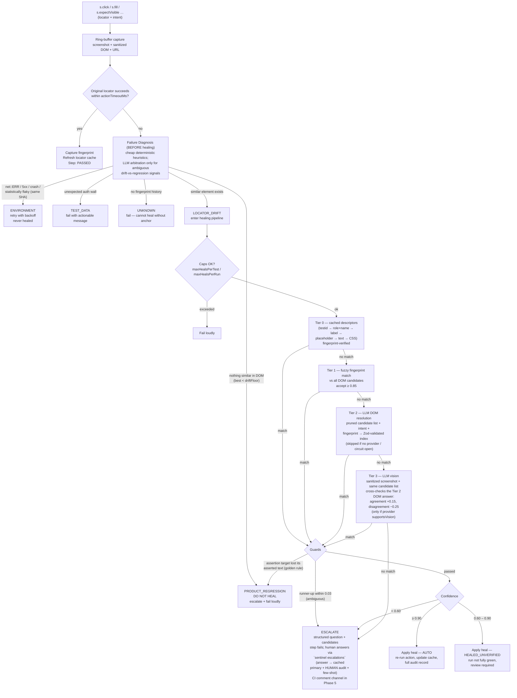

# Sentinel Architecture

Sentinel wraps Playwright interactions in a fixture that pairs a deterministic locator with
a semantic **intent** string. Locators are treated as a _cache of intent_: when they break,
a tiered pipeline re-resolves the intent against the live page, applies confidence-gated
autonomy, and records everything in SQLite for replay, audit, and promotion.

## Package layout

| Package               | Purpose                                                                                                                             |
| --------------------- | ----------------------------------------------------------------------------------------------------------------------------------- |
| `@sentinel/core`      | `test` fixture (`s.*` actions), diagnosis classifier, Tier 0–1 healing, SQLite store, artifact capture, sanitizer                   |
| `@sentinel/cli`       | `sentinel` command: `init`, `run`, `report`, `summary`, `escalations`, `migrate`, `promote`, `db export/import`, `doctor`, `studio` |
| `@sentinel/providers` | `LLMProvider` abstraction, openai-compatible adapter (+ 'openai' preset), retries/backoff/circuit breaker, cost hooks               |
| `@sentinel/report`    | Static self-contained HTML report + the shared query functions the Studio API reuses                                                |
| `@sentinel/ops`       | Orchestration shared by CLI and Studio: run spawning/finalizing, promotion planner/applier, git branch + Octokit PR opening         |
| `@sentinel/flow`      | The no-code flow format (D39): Zod schema, flow → generated-spec compiler, hand-written-spec importer                               |
| `@sentinel/server`    | Sentinel Studio backend: Fastify JSON API, run controller, Smart Recorder, flow CRUD, SSE event stream, SPA host                    |
| `@sentinel/web`       | Sentinel Studio SPA (Vite + React + TanStack Query): runs, escalations, promote, flows/block editor, recorder                       |
| `examples/demo-app`   | Offline demo shop, server-side mutation profiles, `POST /__chaos` switch                                                            |
| `examples/mock-llm`   | Deterministic OpenAI-compatible mock server used by the chaos harness (offline Tier 2 proof)                                        |
| `examples/tests`      | Intent-annotated example suite + chaos-harness integration test                                                                     |

## Step execution & healing pipeline

## Data model (SQLite, WAL)

Single portable `.sentinel/sentinel.db`; JSON export/import for CI artifacts.

| Table           | Contents                                                                                          |
| --------------- | ------------------------------------------------------------------------------------------------- |
| `runs`          | run id, git SHA, heal mode, status, summary JSON                                                  |
| `test_results`  | per test per run: status (`passed` / `passed_unverified` / `failed`), duration, flaky tag         |
| `steps`         | every `s.*` call: action, intent, status, heal tier, confidence, classification, URL              |
| `locator_cache` | (testId, stepId) → primary descriptor, ranked alternates, fingerprint, intent, lastVerifiedAt     |
| `heals`         | full audit: old/new locator, tier, confidence, mode, reasoning, before/after screenshots, git SHA |
| `escalations`   | structured question JSON, status, answer, answeredBy, channel                                     |
| `flake_stats`   | test × git SHA × run → pass/fail (statistical flake detection)                                    |
| `llm_calls`     | provider, model, purpose, tokens, cost, latency (populated from Phase 2)                          |

## Element fingerprints

Captured in-page on every successful step by `sentinelDomAgent` (a single self-contained
function Playwright serializes into the browser): tag, implicit/explicit role, approximate
accessible name, own text, id, testid, classes, whitelisted attributes, associated label,
nearest-meaningful-container text, and an exact positional CSS path. The fingerprint is the
semantic anchor for Tier 0 verification, Tier 1 fuzzy matching, sibling disambiguation, and
(Phase 2) LLM context.

## LLM path (Tier 2)

`LLMProvider` is one method — `complete(request)` — with message + image input and
best-effort JSON mode; adapters own per-request timeouts (AbortSignal). The resilience
wrapper adds deterministic exponential backoff retries, per-attempt `llm_calls` accounting
(tokens, cost, latency, purpose), and a circuit breaker: after N consecutive failures the
circuit opens, the run is flagged `healingUnavailable`, Tier 2 leaves the pipeline, and
healing continues deterministic-only — a dead endpoint can never hang a run.

Tier 2 requests contain: the trusted intent, the last-known fingerprint, prior human
escalation answers for the step (few-shot), and a size-budgeted candidate list wrapped in
UNTRUSTED-data markers with an injection-defense system prompt. The model may only return
`{elementIndex, confidence, reasoning}` (Zod-validated, bounds-checked; malformed replies
get repair prompts, then count as low confidence). All §4/§6 guards — assertion guard,
ambiguity, confidence bands, plus a contradictory-signal cap — apply to LLM heals exactly
as to deterministic ones.

## CI integration (GitHub Actions)

`.github/workflows/sentinel.yml` is a reusable workflow (`workflow_call`): restores the
locator cache (portable JSON export) from `actions/cache`, runs shards with per-shard run
ids and DBs, uploads shard state + heal screenshots, then a merge job imports every shard
export (idempotent by D11), generates the HTML report artifact, writes the aggregated
summary to `$GITHUB_STEP_SUMMARY`, upserts a single PR comment (or a
`sentinel-needs-human` issue on push builds), raises an `action_required` check run when
questions are pending, and saves the merged cache. The only secret is the LLM key; absent,
healing runs Tiers 0–1.

`.github/workflows/sentinel-escalation-answer.yml` listens for maintainer comments
matching `/sentinel choose <id> <label>`, applies the answer through the same code path as
the local CLI, persists the updated cache, and replies with the outcome. `sentinel init`
scaffolds a self-contained single-job variant for end-user projects.

## Sentinel Studio (web UI)

Studio is a **local-first, single-user** dashboard (`sentinel studio`, binds
`127.0.0.1:4300`) layered on the same primitives as the CLI — every write goes through
shared code, never a parallel implementation:

- **Server** (`@sentinel/server`): Fastify app over the SQLite store. Read endpoints
  reuse `@sentinel/report`'s query functions, so the dashboard and the static report can
  never diverge. Write endpoints: answer escalations (same `applyEscalationAnswer` as
  the CLI, channel `web`), trigger runs (spawns `playwright test` via `@sentinel/ops`,
  one at a time — all other writes 409 while a run is active), promote → PR
  (`promoteAndOpenPr`: branch, commit, push, Octokit PR; token from
  `GITHUB_TOKEN`/`SENTINEL_GITHUB_TOKEN`, local-commit-only without one), flow CRUD, and
  the recorder. Started without a loadable config it degrades to read-only.
- **Flows** (`@sentinel/flow`, D38/D39): UI-authored tests are JSON flow documents
  compiled to `@sentinel-generated` specs; hand-written linear specs can be imported
  (all-or-nothing) with full healing-history migration (`store.rekeyTest`/`rekeyStep`).
  Verbs: goto, click, fill, select, check, uncheck, press, expectVisible, expectText
  (D40).
- **Smart Recorder** (D39/D41): headed Playwright browser; capture-phase listeners
  fingerprint interactions with the same serialized `sentinelDomAgent` healing uses.
  Heuristic intents immediately, one batched LLM refinement on save, passwords masked
  in-page. Assert mode turns clicks into expectVisible/expectText drafts (D41). Saving
  writes flow + spec and seeds the Tier-0 cache — recorded tests are born healable.
- **Liveness** (D42): one SSE stream (`GET /api/events`) pushes typed wake-up events
  (run output/finish, recorder changes, escalation answers, promotions); the SPA
  invalidates its query caches on each event, with relaxed polling as fallback.

## Security guardrails in this phase

- DOM snapshots sanitized **in-page** before capture: input values stripped, secret-pattern
  fields masked, configurable redaction selectors, scripts dropped.
- Consent flows only via explicit, logged `preSteps` config.
- Hard caps on heals per test/run — exceeding fails loudly.
- Assertion guard + PRODUCT_REGRESSION classification enforce the golden rule.

## Phase status

| Phase | Scope                                                                          | Status                                                                                                |
| ----- | ------------------------------------------------------------------------------ | ----------------------------------------------------------------------------------------------------- |
| 1     | Core fixture, SQLite layer, Tiers 0–1, demo app + chaos harness                | ✅ complete — chaos harness green                                                                     |
| 2     | Provider abstraction, OpenAI-compatible adapter, Tier 2                        | ✅ complete — chaos harness green (incl. mock-LLM + dead-endpoint phases)                             |
| 3     | LLM-assisted classifier, confidence policy integration, CLI escalation answers | ✅ complete — chaos green (ambiguous-regression + answer-replay phases); verified live on Gemma 4 31B |
| 4     | Anthropic/OpenAI/Gemini adapters, Tier 3 vision, HTML report                   | ✅ complete — chaos green (vision + report phases); native Gemini adapter + vision verified live      |
| 5     | GitHub Actions workflows, cache persistence, comment escalation                | ✅ complete — chaos green incl. CI-simulation phase; workflow contracts validated                     |
| 6     | `migrate` codemod, `promote`, docs polish                                      | ✅ complete — chaos green (migrate-run + promote phases); **all spec phases delivered**               |

### Studio phases (post-spec, D38–D42)

| Studio phase | Scope                                                                                                      | Status      |
| ------------ | ---------------------------------------------------------------------------------------------------------- | ----------- |
| 1            | Local dashboard: read API + SPA, escalation answering, run triggering, promote → PR                        | ✅ complete |
| 2            | `stepKey` identity, flow format + compiler + importer, flow CRUD, Smart Recorder MVP, block editor         | ✅ complete |
| 3            | Verb expansion (select/check/uncheck/press), recorder assert mode, one-click approvals, SSE liveness, docs | ✅ complete |
